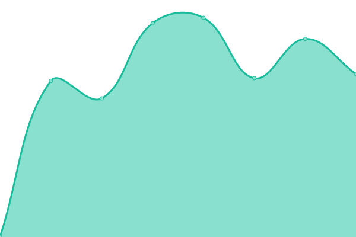
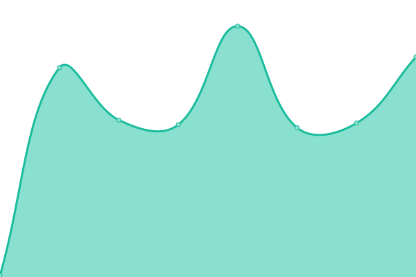

# [📈 Live Status](https://demo.upptime.js.org): <!--live status--> **🟩 All systems operational**

This repository contains the open-source uptime monitor and status page for [Crakernano](http://www.crakernano.com), powered by [Upptime](https://github.com/upptime/upptime).

With [Upptime](https://upptime.js.org), you can get your own unlimited and free uptime monitor and status page, powered entirely by a GitHub repository. We use [Issues](https://github.com/crakernano/status-page/issues) as incident reports, [Actions](https://github.com/crakernano/status-page/actions) as uptime monitors, and [Pages](https://demo.upptime.js.org) for the status page.

<!--start: status pages-->
<!-- This summary is generated by Upptime (https://github.com/upptime/upptime) -->
<!-- Do not edit this manually, your changes will be overwritten -->
<!-- prettier-ignore -->
| URL | Status | History | Response Time | Uptime |
| --- | ------ | ------- | ------------- | ------ |
|  [web](https://nami-tech.es/) | 🟩 Up | [web.yml](https://github.com/NaMiTech/status-page/commits/HEAD/history/web.yml) | 

 988ms
     
 | 

<a href="https://NaMiTech.github.io/status-page/history/web">100.00%</a>
    

|  [room2learn](https://nami-tech.es/room2learn-api/v1/status) | 🟩 Up | [room2learn.yml](https://github.com/NaMiTech/status-page/commits/HEAD/history/room2learn.yml) | 

 125ms
     
 | 

<a href="https://NaMiTech.github.io/status-page/history/room2learn">100.00%</a>
    

|  [Dreambook](https://nami-tech.es/dreambook/health/) | 🟩 Up | [dreambook.yml](https://github.com/NaMiTech/status-page/commits/HEAD/history/dreambook.yml) | 

 119ms
     
 | 

<a href="https://NaMiTech.github.io/status-page/history/dreambook">100.00%</a>
    

|  [SmartEat](https://nami-tech.es/barcodeapi/v1/status) | 🟩 Up | [smart-eat.yml](https://github.com/NaMiTech/status-page/commits/HEAD/history/smart-eat.yml) | 

 123ms
     
 | 

<a href="https://NaMiTech.github.io/status-page/history/smart-eat">100.00%</a>
    

<!--end: status pages-->

[**Visit our status website →**](https://demo.upptime.js.org)

## 📄 License

- Powered by: [Upptime](https://github.com/upptime/upptime)
- Code: [MIT](./LICENSE) © [Crakernano](http://www.crakernano.com)
- Data in the `./history` directory: [Open Database License](https://opendatacommons.org/licenses/odbl/1-0/)
